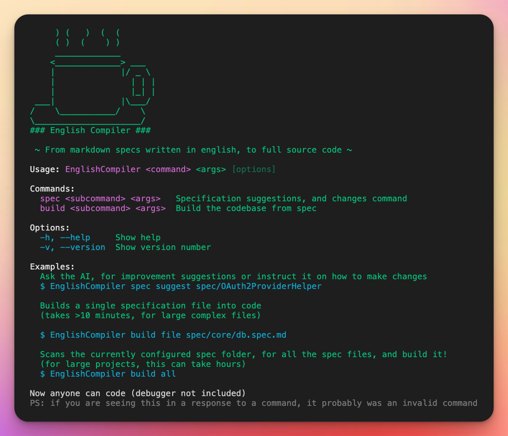
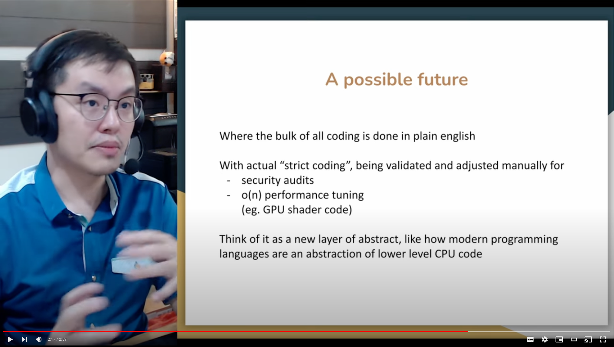
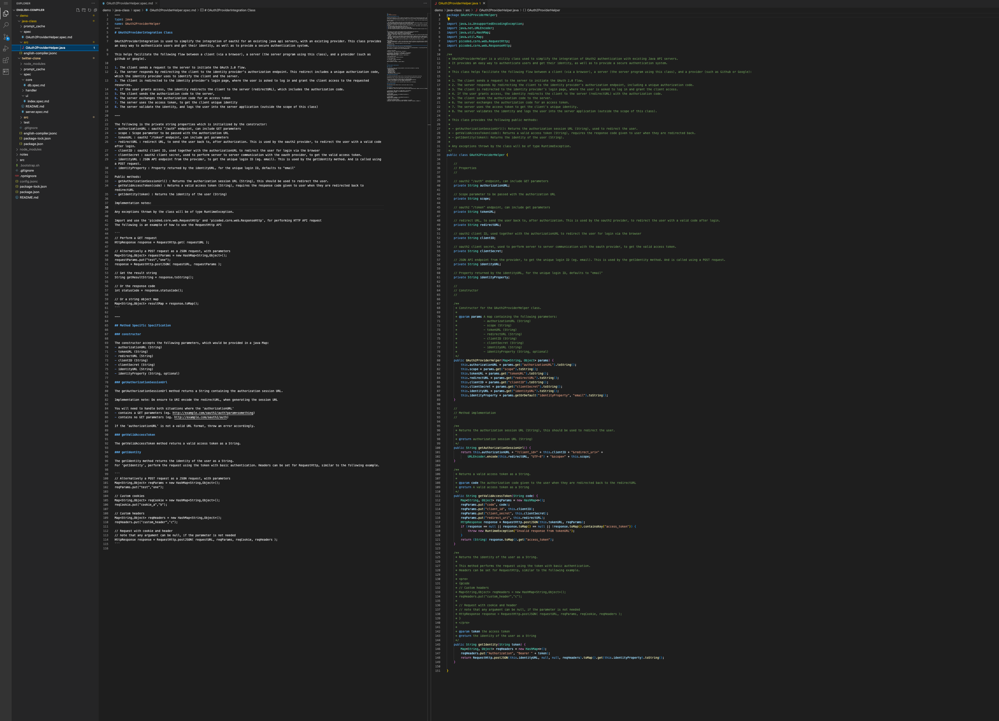
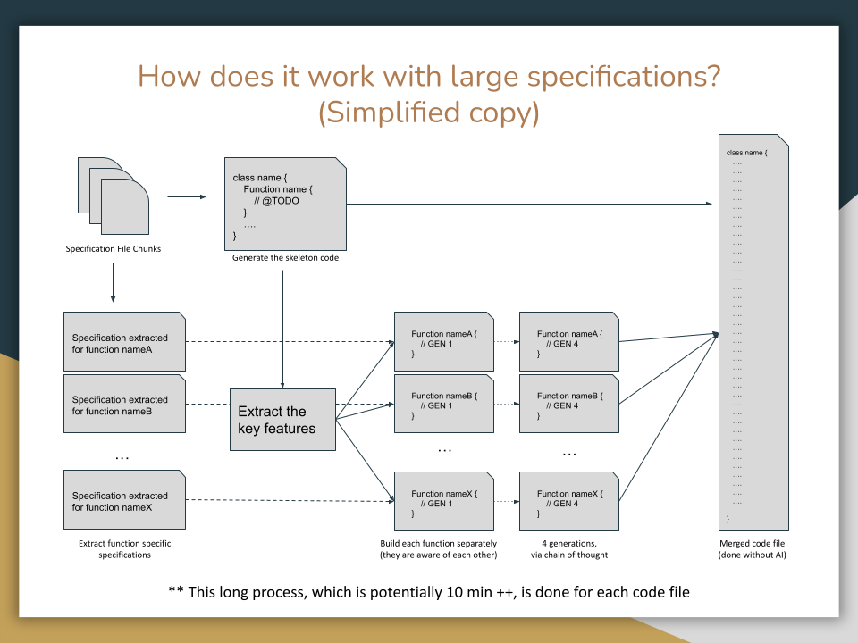
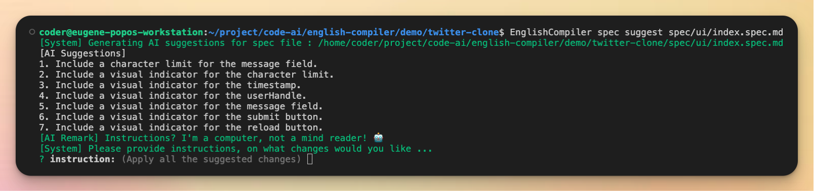
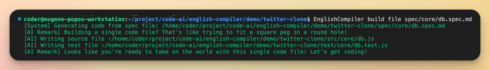
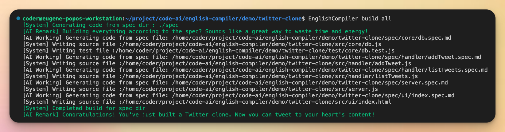

# The English Compiler

We know that all great™ projects start with awesome™ detailed functional specifications.
Which is typically written in [English](https://esolangs.org/wiki/English), or its many other spoken language alternatives.

So what if, instead of writing code from functional specs, we simply compile it directly to code?




> Does it work? Yes  
> Is it production ready? No  
> 
> This is simply a POC. However if you like to take it further, you may give it a try.

For more details, see the 3 minute youtube presentation

[](https://www.youtube.com/watch?v=hdPG-avfpZo)

# How is this "better" then ChatGPT ?

Existing Open AI models, have an upper cap to the size of their input and output.
This limits their usage to small code snippets as of now.

We work around this limitation, by using ridiculous amount of impractical prompt chaining and engineering. Where we are be able to generate both entire applications across multiple files.
Or really large (java) files. Or both.


> An example of how large the OAuth2 integration specification and code with comment results into

This unfortunately means its a slow process



Where in order to build a large code file, multiple calls to the AI process needs to be done (almost every arrow in the digram, is an AI call)

However, this helps validate the possible future, of AI being a potential new abstraction compiler layer, to existing modern programming language.
Just as how modern programming languages are an abstract layer to operating system apis, which is in turn is an abstraction to machine code.

# How do I install it?

The easiest way is to simply install it from NPM

```.bash
npm install -g english-compiler
```

# How do I configure it?

From the project you wish to build from, you should at minimum have a folder for the specs file, and the source code.
You can then setup an `english-compiler.jsonc` file, which should contain all the required settings. Including the openai API key.

For obvious reasons, please do not checkin your openai API key to a public repo

The following is an example of the settings
```.jsonc
{
	// Openai API key
	"openai_apikey": "REPLACE-WITH-YOUR-ACTUAL-KEY-AND-DO-NOT-CHECKIN",

	// Prompt caching dir, this can be used to cache and speed up the build process
	// especially when no specification (or code) changes occured
	//
	// This cache is also critical, in event that you hit the openAI rate limit 
	// (or when their server becomes too busy with chatGPT). As it will abort the build.
	//
	// Caching the prompts, allow you to continue the build, without starting from scratch.
	"prompt_cache_dir": "./prompt_cache",

	// Specification directory, to scan for `*.spec.md` files
	"spec_dir": "./spec",

	// Source code output directory
	"code_dir": "./src",

	// Test code output directory (only supported for JS now)
	"test_dir": "./test",

	// Add some personality based remarks, set to false/null if you want to skip this
	// and save on token consumption (this feature is just for fun)
	"personality": "Sassy & Sarcastic"
}
```

# Run one of our demo !

> Note that the demo, include a precomputed cache of the AI compilation process, so unless you change part of the spec file. You do not need to update the openai key in the settings.
>
> Also yes, the output has some minor bugs here and there. This is a Proof-of-concept.
>
> I have spent over 4 hours, trying to slowly change the specs, and fix all the bugs. But the write-compile-test loop is just too damn slow. And I am out of time for the hackaton.

## Demo 1 : Building a simple "twitter clone" demo

This is a simple complete application for a twitter clone, without login or authentication.
Including both the UI, and the API endpoints.

Go into the `demo/twitter-clone` folder

**Ask the AI for suggestions on a spec file**

`EnglishCompiler spec suggest spec/ui/index.spec.md`



**Build a single spec file**

`EnglishCompiler build file spec/core/db.spec.md`



**Build all spec file**

`EnglishCompiler build all`



If you want to really check, that it buidls the file feel free to delete the src directory, and run the build process.

## Demo 2 : Larger java class

This is an example for a java class, which would have been too large, and goes beyond 4000+ tokens once you include the spec and code comments.
It is not possible to generate this directly via openAI api, without the tricks we have resorted to in this project.

There is only 1 file for this demostartion

Go into the `demo/java-class` folder

**Build all spec file**

`EnglishCompiler build all`

# What is the specification file format?

The specification folder, should contain `$NAME.spec.md` files that is a 1 to 1 mapping to individual code files.

At minimum it should have a markdown frontmatter, with the `type` parameter, for the language, for example

```
---
type: javascript
test: true
---

# DB module
```

`test` is an optional parameter (only supports javascript), that when enabled, will attempt to generate a relevent test script through a seperate process. To avoid contaminating the test code from the source code, this is done in isolation.

From then onwards, the rest is really up to you, on how you want to write your markdown spec

# FAQ 

### Can I use any other language besides English?

Probably yea, whatever the openAI model support (or future LLM model support) should work in theory

### Instead of writing a spec for each code file, isn't it possible to write a higher level specification file?

There was some experimentation done on this, but due to time constraints, it was decided to map them in 1-to-1 manner.
I dun see why not (besides more AI calls), as we can take a similar approach to how we deal with large java classes, by doing a prelimary step of asking the AI how many files it need to make from this one spec file.

### How is this related to Uilicious, or UI testing?

We built our own AI model for test and code generation, and the original concept for this project was to read product specification, and convert it to UI and unit tests, using our finetuned AI model (technically, we use both a custom finetune model, and OpenAI models, in a prompt chain)

However it was very quickly shown, that it will be too damn slow, and not commercially viable in its current state. So the original internal POC, was subsequently rewritten (removing any confidential code, and keys) to the "English Compiler" for this opensource release during the hackaton.

Sidenote: The OAuth2 specification file, is a real specification file that was written, and used as one of our original internal demos.

### Is it possible, to make this possible?

Well we are working on it, by trying to build a model that is "not smarter" with more parameters, but is able to have large contextual token memory. 
This is loosely based on 
- SalesForce codegen model and dataset ( https://github.com/salesforce/CodeGen )  
- The Pile ( https://pile.eleuther.ai/ ) 
- EleutherAI 20B ( https://blog.eleuther.ai/announcing-20b/ ) 
- xP3 instructional tuning dataset ( https://huggingface.co/datasets/bigscience/xP3 )

We are however on a really tight budget, and are fundraising to help speed things up. First for the use of testing, which has a more immediate practical use and require less contextual memory and code complexity. To eventually codegen in general.
